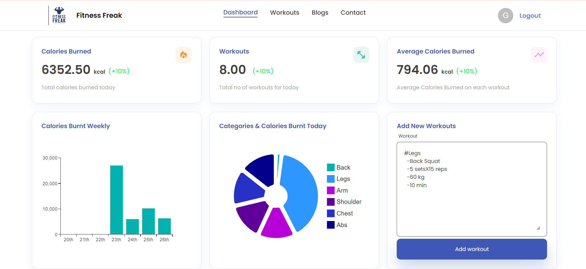
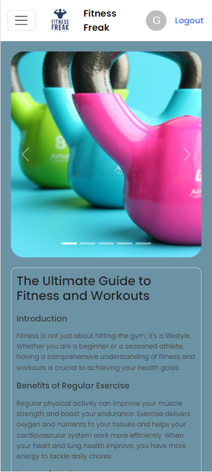

    <h1><b>Fitness Logger Full Stack Development Project💪🏋🏼‍♂️</b></h1>
    <h2>Overview:</h2>
    
The Fitness Logger project is a comprehensive web application designed to help 
      users track their fitness activities, monitor their progress, and set goals to achieve a healthier lifestyle.
      This full-stack application integrates a user-friendly front end with a robust back end, ensuring a seamless and efficient user experience.

    <h3>Key Features:📝</h3>
    <h3>User Authentication:👩🏼‍💻</h3>
    
*Secure login and registration system with JWT (JSON Web Tokens) for authentication.

    <h3>Activity Tracking:🏋🏽‍♂️</h3>
    
*Users can log various types of exercises, including running, cycling, weightlifting, and more.
        *Detailed input forms for recording exercise duration, intensity, and other relevant metrics..

    <h3>Progress Visualization:📊</h3>
    
*Interactive charts and graphs to visualize workout data over time, 
       such as todays workouts, average calories, overall caloreis, calories burned, and workout frequency.

    <h3>Data Management:🌐</h3>
    
*CRUD (Create, Read, Update) operations for managing user data and workout logs.
       *Data storage using a NoSQL database  MongoDB .

    <h3>Responsive Design:</h3>
    
*A mobile-first design approach to ensure the application is accessible and user-friendly on large screen and small screen.

    <h3>API Integration:</h3>
    
*RESTful API endpoints for interaction between the front end and back end, enabling data exchange and functionality extension

    <h2>Technology Stack⚙</h2>
    <ul>
        <li><b>Frontend:</b> React.js with Redux for state management, styled-components for CSS-in-JS styling.</li>
        <li><b>Backend:</b> Node.js with Express.js for server-side logic, and RESTful API design.</li>
        <li><b>Database:</b> MongoDB  for data storage..</li>
        <li><b>Authentication:</b>  JWT for secure authentication and authorization.</li>
        <li><b>Hosting/Deployment:</b>Github for containerization. Netlify and rendor.com for deployment</li>
    </ul>
    <h3>Client-side Dependencies📚</h3>
    <h4>Styled Components and MUI:</h4>
    <ul>
        <li>@emotion/styled: "^11.11.5"</li>
        <li>@mui/icons-material: "^5.15.19"</li>
        <li>@mui/lab: "^5.0.0-alpha.170"</li>
        <li>@mui/material: "^5.15.19"</li>
        <li>@mui/x-charts: "^7.6.2"</li>
        <li>@mui/x-date-pickers: "^7.6.2"</li>
        <li>styled-components: "^6.1.11"</li>
    </ul>
    <h3>Backend Dependencies:📚</h3>
    <h4>Core Libraries:</h4>
    <ul>
        <li>bcrypt: "^5.1.1": For hashing user passwords.</li>
        <li>cors: "^2.8.5": To enable Cross-Origin Resource Sharing.</li>
        <li>dotenv: "^16.4.5": For loading environment variables.</li>
        <li>express: "^4.19.2": Web framework for Node.js.</li>
        <li>jsonwebtoken: "^9.0.2": For creating and verifying JWTs.</li>
        <li>mongoose: "^8.4.1": For MongoDB object modeling.</li>
        <li>nodemon: "^3.1.3": To automatically restart the server during development.</li>
    </ul>
    <h2>Security Measures:🔐</h2>
    <h4>JWT  (JSON Web Tokens):</h4>
    
JWTs are used to securely transmit information between the client and server. Each token contains encoded user information and a signature to verify the token's authenticity. Upon successful login, the server generates a token and sends it to the client, which stores it (usually in localStorage or cookies).
         For subsequent requests, the token is sent in the HTTP headers to authenticate and authorize the user.

    <h4>bcrypt</h4>
    
bcrypt is a password-hashing library used to securely store user passwords. When a user registers, their password is hashed using bcrypt before being saved to the database. When logging in, the entered password is hashed and compared to the stored hash to verify the user’s identity. 
        This ensures that even if the database is compromised, the actual passwords remain secure.
 
    <h3>Learned new things</h3>
    
Styled-Components in CSS: Implemented CSS-in-JS with styled-components, allowing for dynamic styling based on component props and state, leading to a more modular and maintainable codebase.

    <h4>Outcome😊💻</h4>
    
The Fitness Logger application provides a complete solution for fitness enthusiasts, offering tools for tracking, analyzing, and achieving fitness goals. The full-stack design ensures robust performance, scalability, and a seamless user experience.

<h3>Fitness Freak app link👉</h3>
https://fitnessfreak-getup-workout-bygaya3.netlify.app

<h4>FrontEnd deployment:</h4> 
https://fitnessfreak-getup-workout-bygaya3.netlify.app

<h4>BackEnd deployment:</h4> 
https://fitness-freak-wj6v.onrender.com

<h2>And my output will be</h2>

<h2>Thank you..!</h2>

